# ⌚ Watch Me Over – An SOS Application

    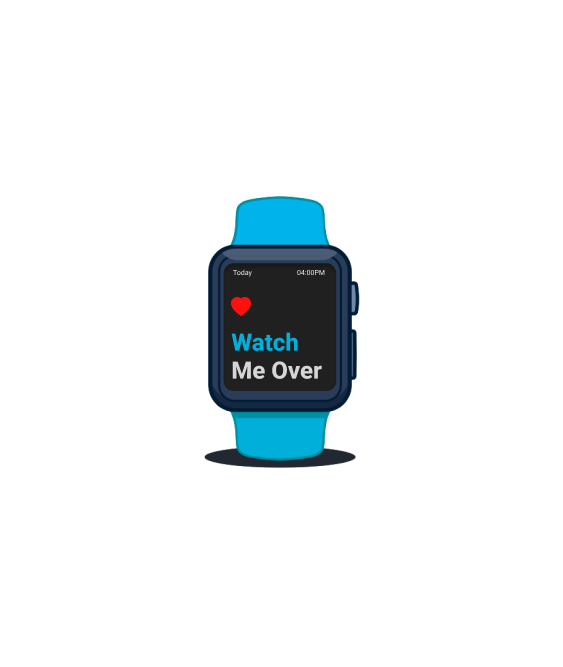

A modern emergency-response mobile application design that integrates smartwatch connectivity to provide timely alerts and support during crises. Designed in Figma, this concept emphasizes **quick access**, **clean UI**, and **real-world usability**.

---

## 🎯 Project Overview

This design is part of a larger vision to build an Android-based SOS alert app. The user flow includes onboarding, watch syncing, body monitoring, emergency triggering, and real-time contact alerts.

---

## 📸 Design Screens

    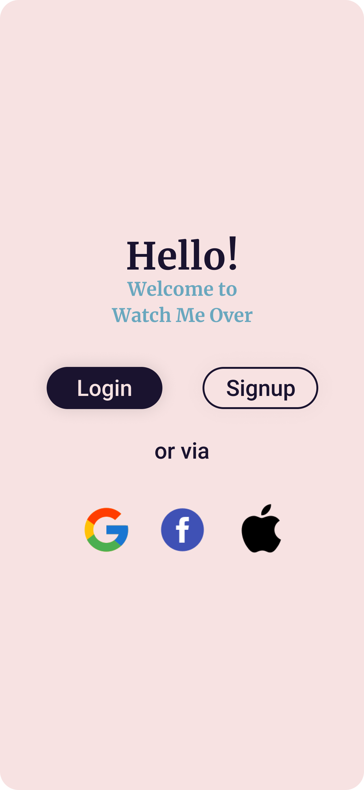 <!-- 1 -->
    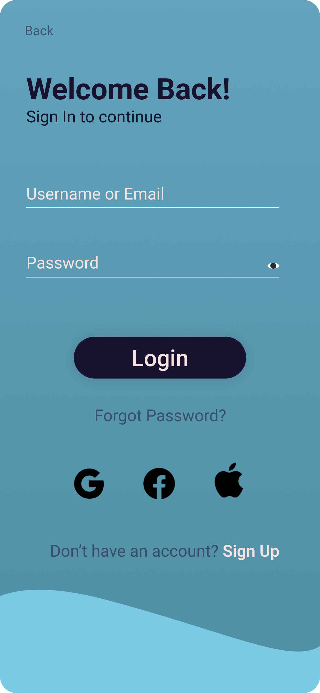 <!-- 2 -->
    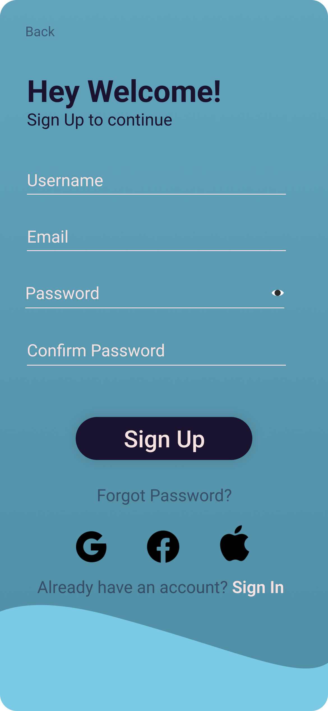 <!-- 3 -->
     <!-- 4 -->
    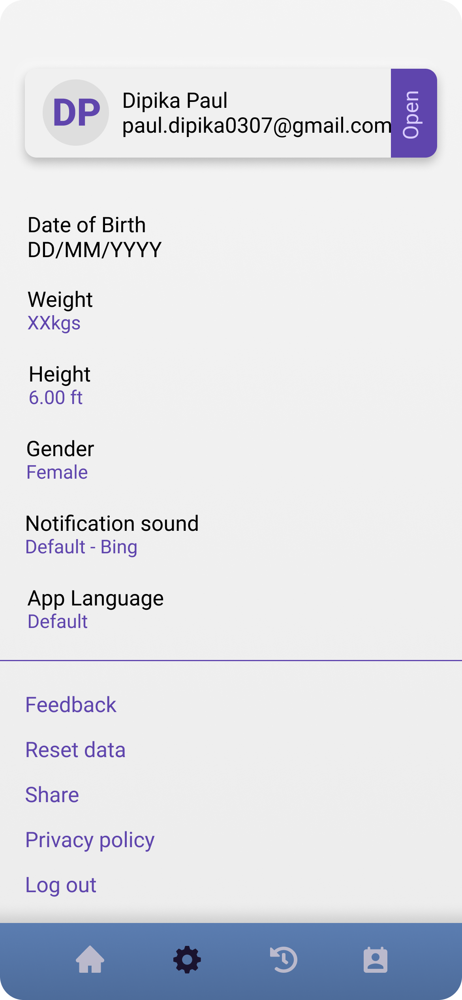 <!-- 5 -->
    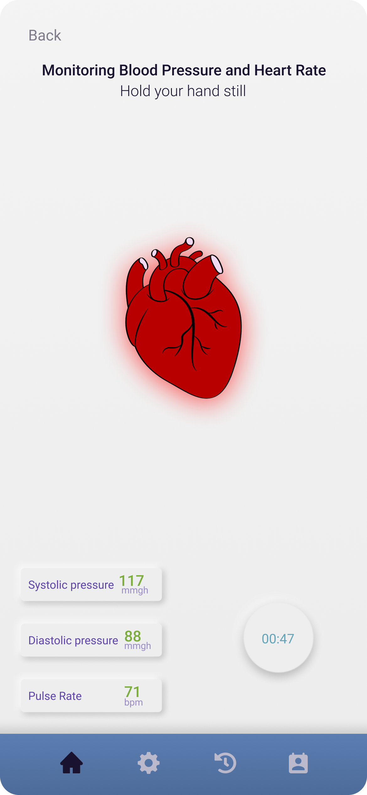<!-- 6 -->
    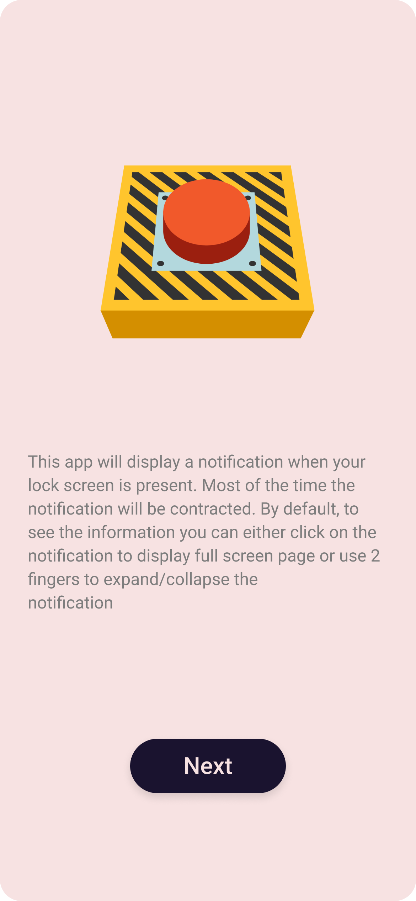<!-- 7 -->
    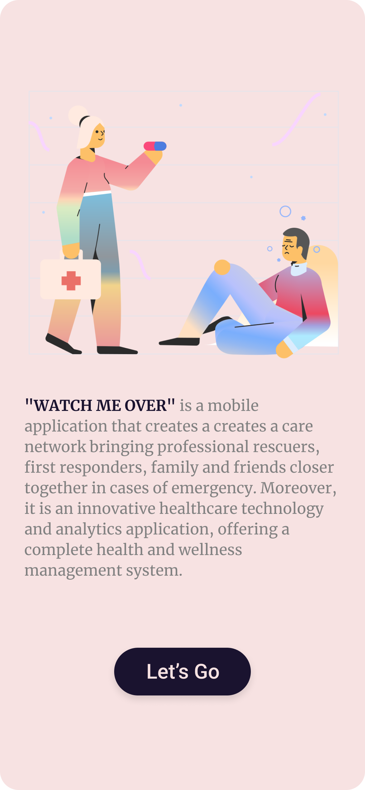<!-- 9 -->
    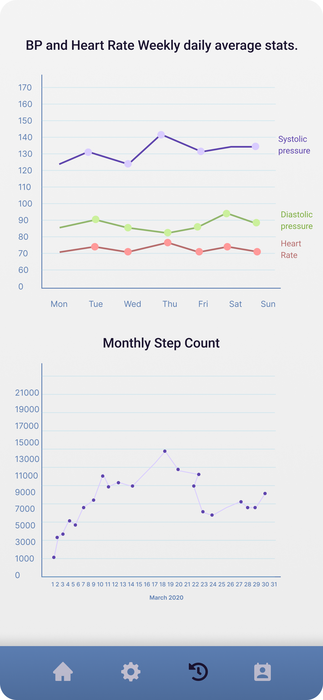<!-- 8 -->
    <!-- 13 -->
    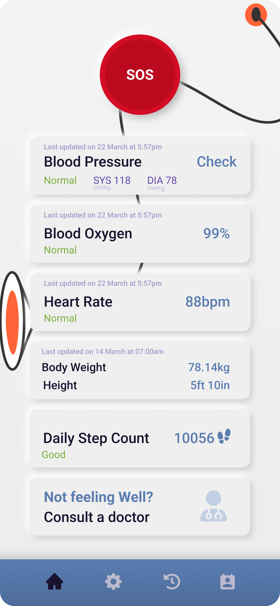<!-- 12 -->
    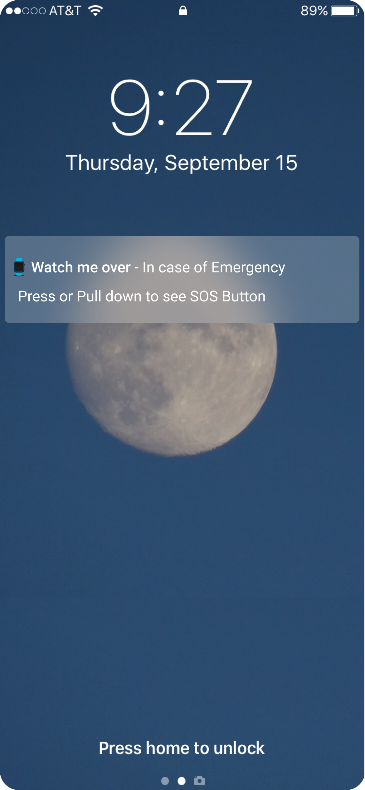<!-- 10 -->
    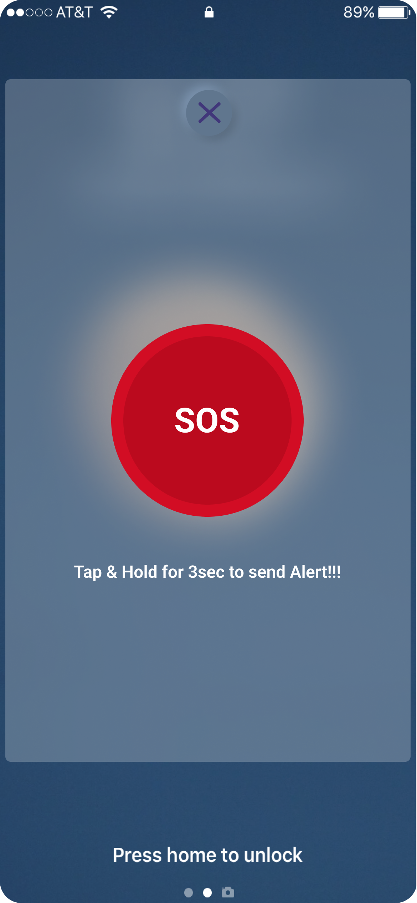<!-- 11 -->

---

## 🧪 Key Features (Planned for Development)

- One-tap emergency alert
- Smartwatch integration
- Body measurement tracking
- Real-time contact notifications
- Clean, accessible UI
- Historical logs and settings management

---

## 🔗 Prototype & Figma File

👉 

## 🎨 Figma Design Preview

> Click the image to explore the full design in Figma.
🔒 Permissions: *Anyone with the link can view*

---

## 🎤 Presentation Deck

📥 [Download Presentation PDF](Watch%20Me%20Over.pdf)

---

## ✨ Future Scope

In the next phase, this design will be converted into a full Android project using Java/Kotlin, Firebase for backend alerts, and WearOS integration.

---

## 🤝 Contribution

Currently a solo project — feedback and contributions welcome!

## 📬 Let's Connect

- Email: [paul.dipika0307@gmail.com](mailto:paul.dipika0307@gmail.com)
- LinkedIn: [linkedin.com/in/dipikapaul](http://www.linkedin.com/in/dipikapaul)
